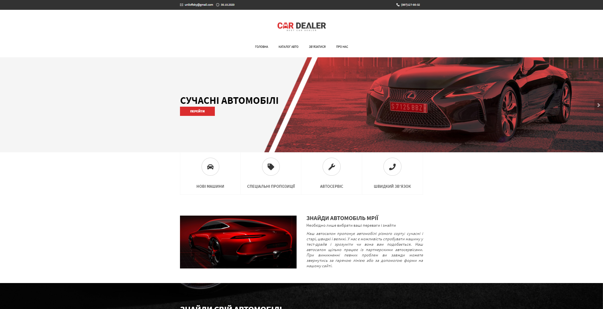
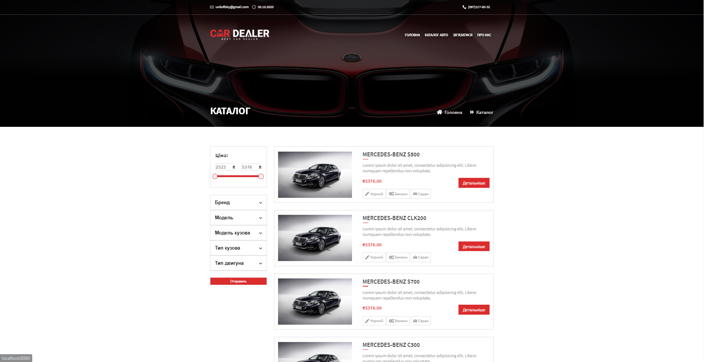
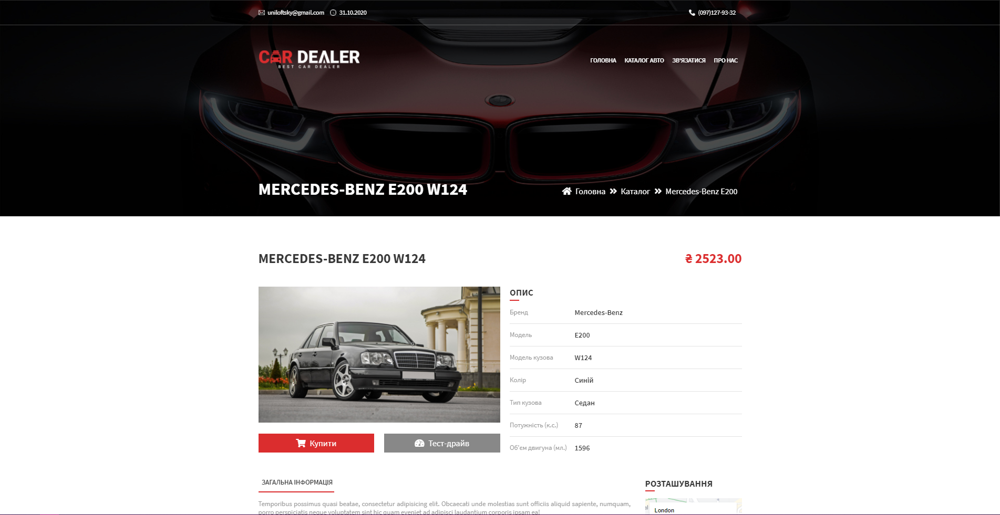
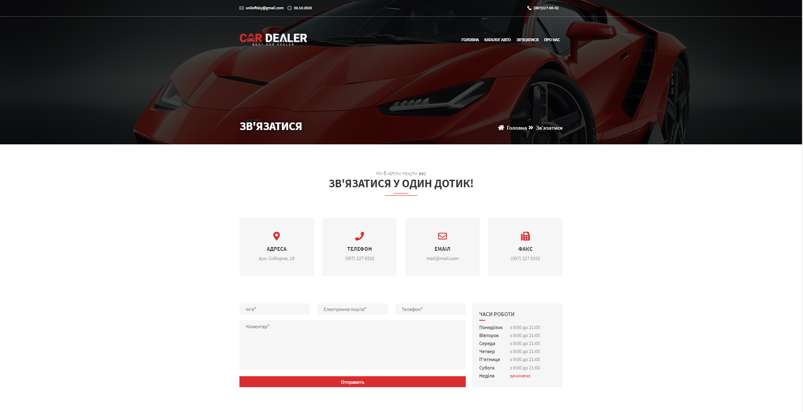
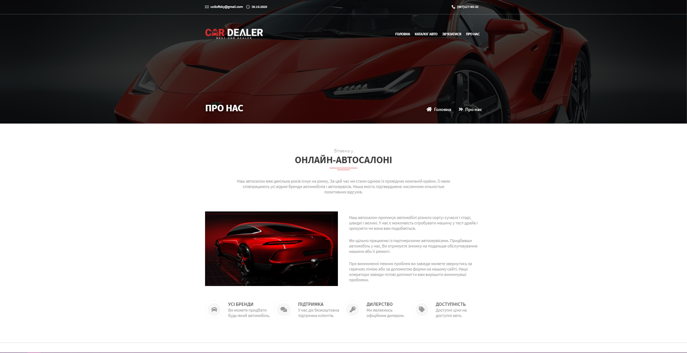

# Spring5 web application - Car Shop

## Getting Started

Carshop app is a Spring Boot application built using Maven. You can build a jar file and run it from the command line (JDK 11 is required):

```bash
git clone https://github.com/uniloftsky/spring5-carshop
cd spring5-carshop
./mvnw package
java -jar target/*.jar
```

You can then access app here: [http://localhost:8080](http://localhost:8080)

## Pages view
Index page view<br>

<hr>

Catalog page view<br>

<hr>

Car details page view<br>

<hr>

Contact page view<br>

<hr>

About page view<br>

<hr>

Spring5 web application for college work.<br>
Used:
<ul>
<li>IDE: IntelliJ IDEA</li>
<li>Framework: Spring5Framework
<ul>
<li>Spring Boot</li>
<li>Spring Security</li>
<li>Spring Data</li>
<li>Spring Web</li>
</ul>
</li>
</ul>
